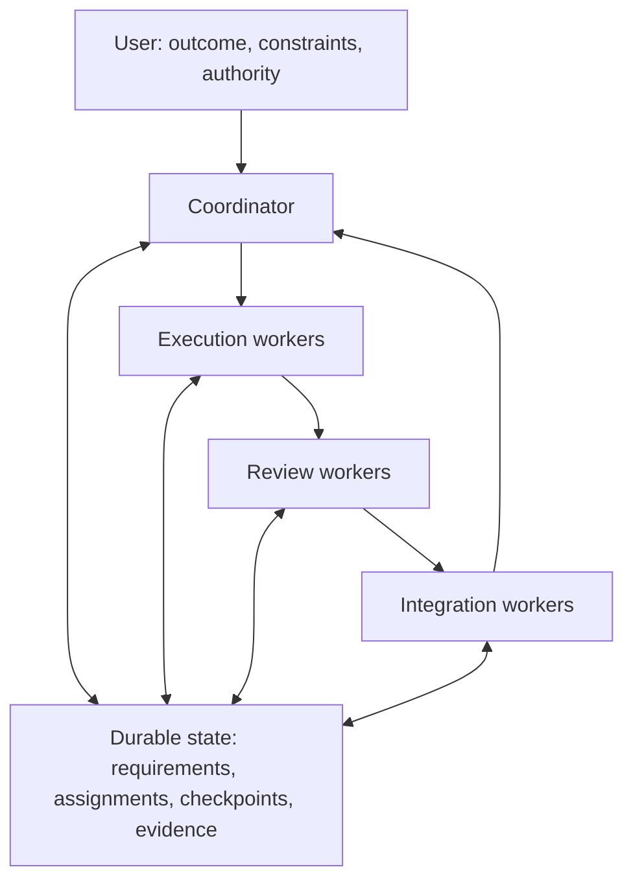

# FoldSpace Orchestrator

**Bridge separate agent contexts. Keep the work connected.**

FoldSpace Orchestrator is a **documentation-based operating protocol for GitHub
Copilot**. It helps teams describe who owns the next action, what evidence makes
work acceptable, and how to continue when sessions, connections, or context
change.

**This repository contains instructions and guides, not executable software.**
There is no package to install, agent service to start, scheduler, extension, or
supervisor included. Automatic behavior depends on capabilities demonstrated in
your actual host; where those capabilities are missing, use explicit
assisted/manual handoffs.

[Get started](docs/GETTING_STARTED.md) |
[Benefits and tradeoffs](docs/BENEFITS.md) |
[Prompt examples](docs/EXAMPLES.md) |
[Operator guide](OPERATOR_GUIDE.md) |
[Contribute](CONTRIBUTING.md)

## On this page

- [Why FoldSpace](#why-foldspace)
- [How it works](#how-it-works)
- [Quick start](#quick-start)
- [Reading path and repository map](#reading-path-and-repository-map)
- [What gets created in your project](#what-gets-created-in-your-project)
- [Deployment scope](#deployment-scope)
- [Capabilities and limits](#capabilities-and-limits)
- [License and name](#license-and-name)

## Why FoldSpace

Long-running AI-assisted work can become a collection of disconnected
conversations: a worker finishes against an old requirement, another waits on an
unrecorded dependency, and a replacement session repeats work whose effects are
still running.

FoldSpace provides a shared operating vocabulary and explicit handoffs instead
of treating more conversations as more progress.

| Problem | Intended improvement | Mechanism |
|---|---|---|
| The main conversation gets buried in execution | Keep coordination available for decisions and steering | Separate coordinator responsibilities from bounded execution work |
| Workers duplicate or conflict with each other | Make ownership and dependencies visible before mutation | Versioned assignments, write scopes, resource reservations, and an accountable owner |
| A restart loses the reasoning behind the work | Make continuation reconstructable | Durable requirements, project state, checkpoints, and recoverable work |
| "Done" refers to an outdated branch or incomplete check | Accept evidence for the actual candidate | Candidate identity, requirement mapping, review, and integration checks |
| A reconnect triggers duplicate actions | Recover deliberately rather than blindly replaying | Capture intent, inspect surviving operations, reconcile effects, then retry only valid pending work |
| Retries quietly consume a fresh budget | Keep effort and cost accountable across replacements | Inherited objective budgets and attempt history |
| Deployment preparation becomes accidental authorization | Separate readiness from permission to create effects | Named candidate, target, gates, and explicit authority |

These are intended mechanisms and outcomes, **not measured speedups or
guarantees**. See [benefits, fit, and measurement](docs/BENEFITS.md) for the costs
and conditions that matter.

### Who it is for

Use it when a developer or team needs to coordinate a meaningful set of
dependent tasks, preserve decisions across sessions, or make review and release
handoffs easier to inspect. It is especially relevant when work spans separate
agent contexts and has real shared resources or external effects.

For a small, isolated edit, a single session and a focused check may be enough.
FoldSpace is not a substitute for engineering judgment, repository protections,
human review, or an execution platform with the controls your workload requires.

## How it works

The coordinator maintains intent, dependencies, assignments, and acceptance
decisions. Workers own substantive execution and their operation records.
Review and integration are explicit responsibilities rather than assumptions
hidden inside a "finished" message.



This is a **conceptual flow**, not a graph of services installed by this pack or
a mandatory serial pipeline. Useful, ready work can overlap; each task waits
only for its actual dependencies. Concurrency follows demonstrated capacity,
shared-resource constraints, review/integration capacity, and the remaining
budget, not a fixed worker count.

The coordinator can perform short coordination reads and updates. Substantive
implementation, repository investigation, reviews, tests, merge operations, and
deployment execution belong to assigned workers. If the host cannot launch
workers without blocking coordination, the fallback is an operator-carried
worker packet, not a claim that background orchestration is active.

Durable records make ownership visible. They do **not** enforce locks or turn
separate worktrees into a transaction system.

## Quick start

1. Read [Getting started](docs/GETTING_STARTED.md) and open the **target
   repository you want to work on**, not this documentation repository.
2. Make [FIRST_SESSION_AND_ORCHESTRATION.md](FIRST_SESSION_AND_ORCHESTRATION.md)
   and [OPERATOR_GUIDE.md](OPERATOR_GUIDE.md) available to its Copilot session as
   references, using a mechanism your host actually supports. Preserve existing
   project instructions.
3. Replace the bracketed fields and send this ordinary-language prompt:

```text
Use the attached FIRST_SESSION_AND_ORCHESTRATION.md and OPERATOR_GUIDE.md
as references for adopting FoldSpace Orchestrator in this target repository.

Project: [new or existing; repository and current state]
Outcome: [a concrete result and how I will recognize it]
Constraints: [scope, compatibility, budget, and actions not authorized]

Preserve existing instructions, requirements, decisions, uncommitted work,
active assignments, running operations, pending steering, and prior authority.
Identify the current coordination owner before creating competing ownership.

Establish the smallest useful project records, reusing authoritative ones.
Record what this host can actually demonstrate. Do not claim native worker
launch, queue capture, recovery, or enforcement without evidence.
For unavailable automation, prepare a bounded manual worker packet with an
explicit return path instead of pretending a worker has started.

Use versioned assignments and candidate-specific acceptance evidence.
Start the next ready, authorized task within the stated budget once ownership
and the necessary capabilities are clear.
```

This is a prompt, **not a built-in command**. It does not authorize publishing,
deploying, deleting resources, or expanding scope beyond the constraints you
provide. A prepared assignment is not evidence that a worker is running.

The full guide covers [new versus existing projects](docs/GETTING_STARTED.md#choose-the-project-path),
[a bounded first task](docs/GETTING_STARTED.md#a-bounded-worked-example), and
[manual worker handoffs](docs/GETTING_STARTED.md#manual-worker-fallback).

## Reading path and repository map

Start with the adoption guide, use the operator guide during work, and consult
the canonical protocol when a handoff, state transition, or recovery decision
needs more precision.

| File | Read it for |
|---|---|
| [README.md](README.md) | Product boundary, overview, and navigation |
| [docs/GETTING_STARTED.md](docs/GETTING_STARTED.md) | Safe adoption, capability recording, first task, and continuation |
| [docs/BENEFITS.md](docs/BENEFITS.md) | Workflow comparisons, appropriate use cases, tradeoffs, and measurement |
| [docs/EXAMPLES.md](docs/EXAMPLES.md) | Ordinary-language prompts for common operating situations |
| [FIRST_SESSION_AND_ORCHESTRATION.md](FIRST_SESSION_AND_ORCHESTRATION.md) | Canonical bootstrap, role boundaries, assignment contracts, durable state, and recovery policy |
| [OPERATOR_GUIDE.md](OPERATOR_GUIDE.md) | Canonical day-to-day steering, worker launch, diagnosis, recovery, and deployment handoffs |
| [DEPLOYMENT_BUILD_INSTRUCTIONS.md](DEPLOYMENT_BUILD_INSTRUCTIONS.md) | Canonical setup distribution and adopter-software build/release guidance |
| [REVIEW_AND_CHANGES.md](REVIEW_AND_CHANGES.md) | Revision rationale, upgrade guidance, and stated verification limits |
| [CONTRIBUTING.md](CONTRIBUTING.md) | Documentation contribution and review expectations |
| [LICENSE](LICENSE) | MIT terms |

The four uppercase root references are the supplied **revision 2.0, dated
6 September 2026**, preserved byte-for-byte. Their original titles remain
unchanged. They are the detailed policy references; the new guides orient
readers rather than create a second specification.

The repository also includes `.gitattributes` to prevent Git text normalization
of those four originals and `.gitignore` for common local artifacts. It ships no
generated project state, runtime implementation, installers, or CI workflows.

## What gets created in your project

During adoption, the protocol calls for small, authoritative project records:
requirements, current state, capabilities, policy, assignments, evidence, and
checkpoints. Suggested locations include `docs/ai/RUNTIME_CORE.md`,
`docs/ai/PROJECT_STATE.md`, and `docs/ai/CAPABILITIES.md`.

**Those are project-specific outputs in your target repository, not
preinstalled assets in this pack.** Reuse an existing tracker or instruction
structure where it already owns the relevant information. Verify that a fresh
session actually discovers the intended records; a file existing on one branch
does not establish activation elsewhere.

Keep durable policy appropriately versioned. Keep secrets, private
conversations, sensitive operational journals, and large transient artifacts
out of public commits; retain recoverable work through suitable controlled
storage and references.

## Deployment scope

The deployment reference addresses two different things:

- Distributing and activating a project's Copilot working setup.
- Preparing and, **when authorized**, releasing that project's actual software.

It does not prescribe a cloud, container platform, pipeline product, or
infrastructure topology. This documentation pack itself needs no package
installation or deployed service.

Preparing a runbook, build artifact, or pipeline file does not grant permission
to change an environment. Existing explicit authority carries forward, but
candidate, target, effects, and required gates must still match it. A verified
release requires observations of the actual destination, not just generated
configuration. See the [deployment prompts](docs/EXAMPLES.md#prepare-a-release-without-implying-permission)
and [canonical deployment reference](DEPLOYMENT_BUILD_INSTRUCTIONS.md).

## Capabilities and limits

Record capabilities as **Verified automatic**, **Assisted**, **Unavailable**,
or **Not checked**, with the observed mechanism, evidence, limits, and exact
fallback action. Demonstrate each capability in the intended host rather than
inferring it from a feature name or documentation link.

In particular, this protocol cannot by itself:

- Enforce locks, fencing, cancellation, permissions, or ownership.
- Wake idle sessions or provide an independent scheduler or supervisor.
- Recover inaccessible unsent UI messages or attachments that were never captured.
- Guarantee exactly-once execution, uninterrupted work, or successful recovery.
- Prove a quiet process has stopped, or that a reconnect did not leave a job running.
- Repair IDE, extension, model-provider, or service defects.
- Certify compatibility with every Copilot host, product version, or workflow.

When effects are uncertain, reconcile before retrying. When the former writer
cannot be stopped or fenced, avoid conflicting replacement writes. When a
required capability or authority is missing, report it and use a safe bounded
alternative; do not label unsupported automation as working.

## License and name

FoldSpace Orchestrator is available under the [MIT License](LICENSE).

The name is inspired by the space-folding idea in *Dune*: a metaphor for
bridging separate agent contexts while keeping the work connected. This is an
independent project, not an official GitHub or Microsoft product and not
affiliated with or endorsed by the owners of *Dune*. No franchise artwork,
logos, characters, or quotations are included.
