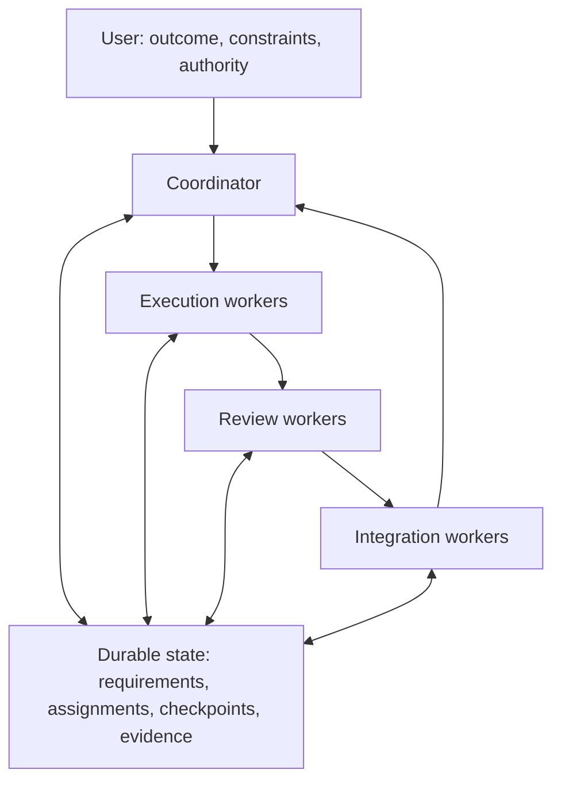

# FoldSpace Orchestrator

**Bridge separate agent contexts. Keep the work connected.**

FoldSpace Orchestrator is a **documentation-based operating protocol for GitHub
Copilot**. It helps teams describe who owns the next action, what evidence makes
work acceptable, and how to continue when sessions, connections, or context
change.

**This repository contains instructions and guides, not executable software.**
There is no package to install, agent service to start, scheduler, extension, or
supervisor included. Automatic behavior depends on capabilities demonstrated in
your actual host; where those capabilities are missing, use explicit
assisted/manual handoffs.

[Get started](GETTING_STARTED.md) |
[Benefits and tradeoffs](BENEFITS.md) |
[Prompt examples](../operations/EXAMPLES.md) |
[Run configuration](../protocol/RUN_CONFIGURATION.md) |
[Operator guide](../operations/OPERATOR_GUIDE.md) |
[Contribute](../.github/CONTRIBUTING.md)

## On this page

- [Why FoldSpace](#why-foldspace)
- [How it works](#how-it-works)
- [Quick start](#quick-start)
- [Configure every new run](#configure-every-new-run)
- [Reading path and repository map](#reading-path-and-repository-map)
- [What gets created in your project](#what-gets-created-in-your-project)
- [Deployment scope](#deployment-scope)
- [Capabilities and limits](#capabilities-and-limits)
- [License and name](#license-and-name)

## Why FoldSpace

Long-running AI-assisted work can become a collection of disconnected
conversations: a worker finishes against an old requirement, another waits on an
unrecorded dependency, and a replacement session repeats work whose effects are
still running.

FoldSpace provides a shared operating vocabulary and explicit handoffs instead
of treating more conversations as more progress.

| Problem | Intended improvement | Mechanism |
|---|---|---|
| The main conversation gets buried in execution | Keep coordination available for decisions and steering | Separate coordinator responsibilities from bounded execution work |
| Workers duplicate or conflict with each other | Make ownership and dependencies visible before mutation | Versioned assignments, write scopes, resource reservations, and an accountable owner |
| A restart loses the reasoning behind the work | Make continuation reconstructable | Durable requirements, project state, checkpoints, and recoverable work |
| "Done" refers to an outdated branch or incomplete check | Accept evidence for the actual candidate | Candidate identity, requirement mapping, review, and integration checks |
| A reconnect triggers duplicate actions | Recover deliberately rather than blindly replaying | Capture intent, inspect surviving operations, reconcile effects, then retry only valid pending work |
| Retries quietly consume a fresh budget | Keep effort and cost accountable across replacements | Inherited objective budgets and attempt history |
| Deployment preparation becomes accidental authorization | Separate readiness from permission to create effects | Named candidate, target, gates, and explicit authority |

These are intended mechanisms and outcomes, **not measured speedups or
guarantees**. See [benefits, fit, and measurement](BENEFITS.md) for the costs
and conditions that matter.

### Who it is for

Use it when a developer or team needs to coordinate a meaningful set of
dependent tasks, preserve decisions across sessions, or make review and release
handoffs easier to inspect. It is especially relevant when work spans separate
agent contexts and has real shared resources or external effects.

For a small, isolated edit, a single session and a focused check may be enough.
FoldSpace is not a substitute for engineering judgment, repository protections,
human review, or an execution platform with the controls your workload requires.

## How it works

The coordinator maintains intent, dependencies, assignments, and acceptance
decisions. Workers own substantive execution and their operation records.
Review and integration are explicit responsibilities rather than assumptions
hidden inside a "finished" message.



This is a **conceptual flow**, not a graph of services installed by this pack or
a mandatory serial pipeline. Useful, ready work can overlap; each task waits
only for its actual dependencies. Concurrency follows demonstrated capacity,
shared-resource constraints, review/integration capacity, and the remaining
budget, not a fixed worker count.

The coordinator can perform short coordination reads and updates. Substantive
implementation, repository investigation, reviews, tests, merge operations, and
deployment execution belong to assigned workers. If the host cannot launch
workers without blocking coordination, the fallback is an operator-carried
worker packet, not a claim that background orchestration is active.

Durable records make ownership visible. They do **not** enforce locks or turn
separate worktrees into a transaction system.

## Quick start

1. Read [Getting started](GETTING_STARTED.md) and open the **target
   repository you want to work on**, not this documentation repository.
2. Make [FIRST_SESSION_AND_ORCHESTRATION.md](../protocol/FIRST_SESSION_AND_ORCHESTRATION.md)
   and [OPERATOR_GUIDE.md](../operations/OPERATOR_GUIDE.md) available to its Copilot session as
   references, using a mechanism your host actually supports. Preserve existing
   project instructions. Complete the mandatory run-configuration interview
   before launching any workers, including discovery workers.
3. Replace the bracketed fields and send this ordinary-language prompt:

```text
Use the attached FIRST_SESSION_AND_ORCHESTRATION.md and OPERATOR_GUIDE.md
as references for adopting FoldSpace Orchestrator in this target repository.

Project: [new or existing; repository and current state]
Outcome: [a concrete result and how I will recognize it]
Constraints: [scope, compatibility, budget, and actions not authorized]

Before starting workers or direct external LLM calls, ask me to approve this
run's exact supported models and role defaults/fallbacks; per-model minimum,
maximum, and default reasoning; external-call consent (disabled is valid);
and aggregate budget/units, allocations, concurrency, retries, and stop policy.
Ask one question at a time where supported. Missing approval is not unlimited
budget or permission to use runtime defaults. External calls default denied.
Reconfirm settings for a new run; preserve approved scope on continuation.

Preserve existing instructions, requirements, decisions, uncommitted work,
active assignments, running operations, pending steering, and prior authority.
Identify the current coordination owner before creating competing ownership.

Establish the smallest useful project records, reusing authoritative ones.
Record what this host can actually demonstrate. Do not claim native worker
launch, queue capture, recovery, or enforcement without evidence.
For unavailable automation, prepare a bounded manual worker packet with an
explicit return path instead of pretending a worker has started.

Use versioned assignments and candidate-specific acceptance evidence.
Start the next ready task only after the approved configuration can actually
be applied and evidenced, ownership is clear, and budget is reserved.
```

This is a prompt, **not a built-in command**. It does not authorize publishing,
deploying, deleting resources, or expanding scope beyond the constraints you
provide. A prepared assignment is not evidence that a worker is running.

The full guide covers [new versus existing projects](GETTING_STARTED.md#choose-the-project-path),
[a bounded first task](GETTING_STARTED.md#a-bounded-worked-example), and
[manual worker handoffs](GETTING_STARTED.md#manual-worker-fallback).

## Configure every new run

Revision **2.1** adds a mandatory bootstrap interview. Before an orchestrated
run starts workers or makes direct external LLM calls, the operator approves:

| Control | Required decision |
|---|---|
| Models | Allowed providers/families and exact supported IDs, role defaults/overrides, and approved fallback models |
| Reasoning | Minimum, maximum, and chosen default for each model, using its verified supported ordering; explicitly accept N/A for fixed or unsupported controls |
| External LLM calls | Explicitly disabled, or consent scoped to provider/endpoint, models, purpose, permitted data, secure credential references, and budget |
| Budget | Aggregate cap and measurable units, native/external allocations and relevant subcaps, concurrency, retries/replacements, and stopping/escalation rules |

Copilot-managed sessions and direct external API calls are distinct permission
and accounting paths. External calls default to **denied**, even if native
Copilot use is authorized. Missing budget is not unlimited; deliberately
uncapped scope requires explicit opt-in. Credits, tokens, calls, and currency
must not be silently converted into one another.

The approved policy is versioned and linked from assignments, results, and
recovery records. Descendants inherit or tighten it. Parallel dispatch reserves
against parent limits; retries, handoffs, and replacements do not reset usage.
Uncertain in-flight charges are reconciled before reallocation.

These are **specified operating gates, not enforcement installed by Markdown**.
If the host cannot select or prove the effective model/reasoning or support a
required budget bound, affected autonomous dispatch is blocked; an explicitly
approved, demonstrable manual path may be used. Safe local planning and the
already-running bootstrap chat are not retroactively blocked.

Use the [questionnaire, configuration example, and decision cases](../protocol/RUN_CONFIGURATION.md).
Reconfirm for each new run; do not repeatedly ask for the same within-run
permission on every call.

## Reading path and repository map

Start with the adoption guide, use the operator guide during work, and consult
the canonical protocol when a handoff, state transition, or recovery decision
needs more precision.

```text
foldspace-orchestrator/
|-- LICENSE
|-- .gitattributes
|-- .gitignore
|-- .github/
|   `-- CONTRIBUTING.md
|-- docs/
|   |-- README.md
|   |-- BENEFITS.md
|   `-- GETTING_STARTED.md
|-- protocol/
|   |-- FIRST_SESSION_AND_ORCHESTRATION.md
|   |-- DEPLOYMENT_BUILD_INSTRUCTIONS.md
|   `-- RUN_CONFIGURATION.md
|-- operations/
|   |-- OPERATOR_GUIDE.md
|   `-- EXAMPLES.md
`-- reference/
    `-- REVIEW_AND_CHANGES.md
```

| File | Read it for |
|---|---|
| [docs/README.md](README.md) | Product boundary, overview, and navigation |
| [docs/GETTING_STARTED.md](GETTING_STARTED.md) | Safe adoption, capability recording, first task, and continuation |
| [docs/BENEFITS.md](BENEFITS.md) | Workflow comparisons, appropriate use cases, tradeoffs, and measurement |
| [operations/EXAMPLES.md](../operations/EXAMPLES.md) | Ordinary-language prompts for common operating situations |
| [protocol/RUN_CONFIGURATION.md](../protocol/RUN_CONFIGURATION.md) | Mandatory pre-run model, reasoning, external-consent, and budget interview |
| [protocol/FIRST_SESSION_AND_ORCHESTRATION.md](../protocol/FIRST_SESSION_AND_ORCHESTRATION.md) | Canonical bootstrap, role boundaries, assignment contracts, durable state, and recovery policy |
| [operations/OPERATOR_GUIDE.md](../operations/OPERATOR_GUIDE.md) | Canonical day-to-day steering, worker launch, diagnosis, recovery, and deployment handoffs |
| [protocol/DEPLOYMENT_BUILD_INSTRUCTIONS.md](../protocol/DEPLOYMENT_BUILD_INSTRUCTIONS.md) | Canonical setup distribution and adopter-software build/release guidance |
| [reference/REVIEW_AND_CHANGES.md](../reference/REVIEW_AND_CHANGES.md) | Revision history, upgrade guidance, and stated verification limits |
| [.github/CONTRIBUTING.md](../.github/CONTRIBUTING.md) | Documentation contribution and review expectations |
| [LICENSE](../LICENSE) | MIT terms |

The active canonical references are **revision 2.1.1, dated 6 September 2026**.
They derive from the supplied revision 2.0 documents, which were preserved
byte-for-byte in the initial publication commit
[`38e9ce2`](https://github.com/taomar/foldspace-orchestrator/commit/38e9ce28964d8038333a2034a6ff02087b4652f9).
Revision 2.1 adds the operator-approved run controls. Revision 2.1.1 corrects
new-run guidance so renewing configuration cannot discard existing project
ownership or release resources still in use. See the
[principles-review correction](../reference/REVIEW_AND_CHANGES.md#revision-211-principles-correction).
Active files are no longer byte-identical to the ZIP. Historical 2.0
verification notes do not establish runtime verification of the current revision.

The repository also includes `.gitattributes` to prevent Git text normalization
of the canonical documents and `.gitignore` for common local artifacts. It ships no
generated project state, runtime implementation, installers, or CI workflows.

## What gets created in your project

During adoption, the protocol calls for small, authoritative project records:
requirements, current state, capabilities, policy, assignments, evidence, and
checkpoints. Suggested locations include `docs/ai/RUNTIME_CORE.md`,
`docs/ai/PROJECT_STATE.md`, and `docs/ai/CAPABILITIES.md`.

**Those are project-specific outputs in your target repository, not
preinstalled assets in this pack.** Reuse an existing tracker or instruction
structure where it already owns the relevant information. Verify that a fresh
session actually discovers the intended records; a file existing on one branch
does not establish activation elsewhere.

Keep durable policy appropriately versioned. Keep secrets, private
conversations, sensitive operational journals, and large transient artifacts
out of public commits; retain recoverable work through suitable controlled
storage and references.

## Deployment scope

The deployment reference addresses two different things:

- Distributing and activating a project's Copilot working setup.
- Preparing and, **when authorized**, releasing that project's actual software.

It does not prescribe a cloud, container platform, pipeline product, or
infrastructure topology. This documentation pack itself needs no package
installation or deployed service.

Preparing a runbook, build artifact, or pipeline file does not grant permission
to change an environment. Existing explicit authority carries forward, but
candidate, target, effects, and required gates must still match it. A verified
release requires observations of the actual destination, not just generated
configuration. See the [deployment prompts](../operations/EXAMPLES.md#prepare-a-release-without-implying-permission)
and [canonical deployment reference](../protocol/DEPLOYMENT_BUILD_INSTRUCTIONS.md).

## Capabilities and limits

Record capabilities as **Verified automatic**, **Assisted**, **Unavailable**,
or **Not checked**, with the observed mechanism, evidence, limits, and exact
fallback action. Demonstrate each capability in the intended host rather than
inferring it from a feature name or documentation link.

In particular, this protocol cannot by itself:

- Enforce locks, fencing, cancellation, permissions, or ownership.
- Wake idle sessions or provide an independent scheduler or supervisor.
- Recover inaccessible unsent UI messages or attachments that were never captured.
- Guarantee exactly-once execution, uninterrupted work, or successful recovery.
- Prove a quiet process has stopped, or that a reconnect did not leave a job running.
- Repair IDE, extension, model-provider, or service defects.
- Certify compatibility with every Copilot host, product version, or workflow.

When effects are uncertain, reconcile before retrying. When the former writer
cannot be stopped or fenced, avoid conflicting replacement writes. When a
required capability or authority is missing, report it and use a safe bounded
alternative; do not label unsupported automation as working.

## License and name

FoldSpace Orchestrator is available under the [MIT License](../LICENSE).

The name is inspired by the space-folding idea in *Dune*: a metaphor for
bridging separate agent contexts while keeping the work connected. This is an
independent project, not an official GitHub or Microsoft product and not
affiliated with or endorsed by the owners of *Dune*. No franchise artwork,
logos, characters, or quotations are included.
