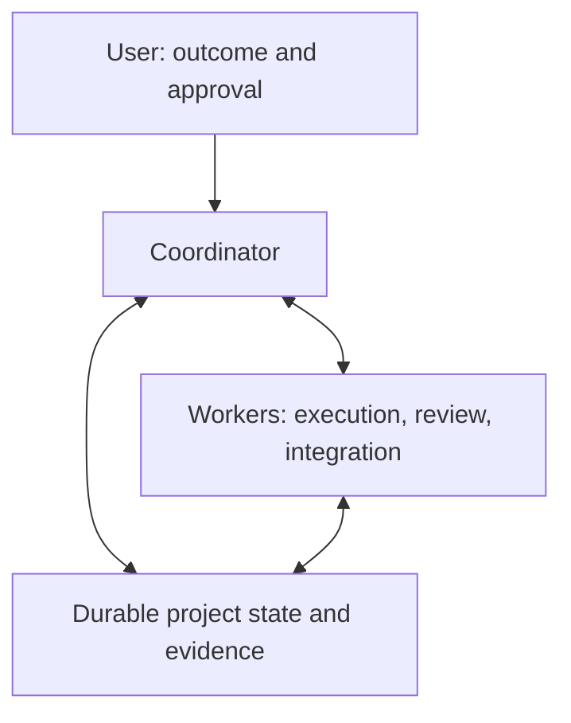

# FoldSpace Orchestrator

**Bridge separate agent contexts. Keep the work connected.**

FoldSpace is a **documentation-based operating protocol for GitHub Copilot**:
explicit coordination, bounded worker assignments, durable project memory, and
evidence-based acceptance.

**These are instructions and guides, not executable software.** No runtime,
scheduler, extension, or supervisor is installed. Use demonstrated host
capabilities or an explicit assisted/manual handoff.

[Get started](GETTING_STARTED.md) |
[Upgrade an existing setup](GETTING_STARTED.md#upgrade-without-resetting-live-work) |
[Benefits](BENEFITS.md) |
[Prompt examples](../operations/EXAMPLES.md) |
[Run configuration](../protocol/RUN_CONFIGURATION.md)

Current protocol: **2.1.5**. See the [release history](../reference/REVIEW_AND_CHANGES.md).

## On this page

[Why FoldSpace](#why-foldspace) |
[Quick start](#quick-start) |
[Run controls](#configure-every-new-run) |
[Files and reading path](#reading-path-and-repository-map) |
[Limits](#capabilities-and-limits)

## Why FoldSpace

Separate agent conversations can lose track of who owns work, which
requirements are current, and whether a previous operation actually finished.
FoldSpace makes those handoffs explicit.

| Instead of... | Use... |
|---|---|
| Vague delegation and overlapping edits | Versioned assignments, named owners, and bounded write/resource scopes |
| Waiting for every worker before moving on | Ready work driven by its actual dependencies and available capacity |
| Accepting an unexplained "done" | Evidence tied to the actual candidate and acceptance criteria |
| Restarting from memory or blindly retrying | Durable state, recoverable work, and reconciliation of surviving effects |

These mechanisms are intended to improve continuity and accountability, not
promise measured speedups. Read the [benefits and tradeoffs](BENEFITS.md).

### Who it is for

Developers and teams coordinating dependent work across sessions, especially
when review, shared resources, or release handoffs matter. For a small isolated
edit, one session and a focused check may be simpler.

## How it works

The coordinator handles intent, dependencies, assignments, and acceptance.
Workers own substantive execution, review, integration, and operation records.



This is a conceptual flow, **not an installed service or a mandatory serial
pipeline**. Each task waits on its own dependencies. Concurrency follows
approved limits, demonstrated capacity, resource ownership, and review capacity,
not a fixed worker count.

## Quick start

**Already using FoldSpace?** Open your existing project and use the
[in-place upgrade prompt](GETTING_STARTED.md#upgrade-without-resetting-live-work).
It pins revision 2.1.5 and preserves live work, customizations, valid approvals
and accounting; upgrading alone does not start a new run. If messages only
queue, follow the guide's responsive-session recovery warning before pasting.

1. Open the **target repository** where you want to build, in your Copilot host.
2. Paste the prompt below with your outcome. **No clone, ZIP, attachment or
   manual copy step is needed** in the supported URL-first path.
3. Answer the configuration questions and give final approval. Copilot then
   assigns a setup worker to fetch and localize the needed references safely,
   adapt your existing project instructions, and continue your build task.

```text
Use FoldSpace Orchestrator in this target repository. Do not clone the pack.
Read only this public Markdown entry first:
https://raw.githubusercontent.com/taomar/foldspace-orchestrator/main/protocol/BOOTSTRAP.md
Target: [repository; new project, new run in an existing project, or continuation]
Outcome and acceptance: [one bounded result and observable criteria]
Constraints and authority: [allowed scope, compatibility, and excluded effects]

Preserve existing instructions, work, active owners, operations, and accounting.
First reconcile supplied intent/run mode and any prestaged answers.
One question at a time means one outstanding unanswered question, not one
answered decision per response. On an answer (including a question-tool result),
take the next bounded read, focused question, review/final approval request or
approved action. Do not stop at "recorded/blocked" or require another "continue".
For pending work use known compact state/task records, not an invented backlog;
ask the exact location/access or focused selection if needed.
Yield only for a real wait with its gap, owner and supported event/manual action,
following the host's actual question lifecycle. No scans, polling or full-job waits.
For a new run, conduct the mandatory interview one question at a time:
exact supported models/role defaults/fallbacks, per-model reasoning bounds and
default, external-call consent, budgets/units and allocations, concurrency,
retries, and stop policy. Ask for final approval; use no silent defaults.
Until then, use only bounded public reference reads and safe local preparation
in this current chat. Do not upload private project data or use external inference.

After approval, reserve budget and assign a setup worker to pin one GitHub
commit, fetch the required linked references and license, preview conflicts,
and save versioned reference copies without overwriting my instructions/work.
Adapt existing project-native instructions/state, record source provenance,
verify discovery, and continue my actual build objective. Use demonstrated
tools or report the exact missing permission/capability; do not invent success.
Accept candidate-specific evidence and preserve scope and release authority.
Before depending on idle delivery, establish durable intent/results, actual
receiver receipt/pickup and verified independent observation/recovery or an
accepted operator handoff. "Sent" alone is not delivery; no repeated wake spam.
```

This is ordinary language, not a native command. The
[first-use guide](GETTING_STARTED.md) explains agent-managed localization, a
[worked example](GETTING_STARTED.md#a-bounded-worked-example), and
[manual fallback](GETTING_STARTED.md#manual-worker-fallback).
Optionally paste known answers using the
[prestaging checklist and template](../protocol/RUN_CONFIGURATION.md#optional-prestaged-interview-inputs);
unknowns are fine, and preparation is not final run approval.

## Prevent stranded work and recover missed delivery

FoldSpace requires durable intent and results **outside the chat queue**,
separate receiver-receipt/pickup evidence, and a demonstrated path that resumes
work after the coordinator goes idle. Before unattended handoff, an independent
observer must be armed with finite detection/recovery limits and an alternate
alert/control route. Otherwise use an explicitly accepted operator-carried path.

On missed delivery: stop redundant sends, preserve accessible queued input,
resume through independent host controls or safely transfer ownership, reconcile
completed work and live effects, then restore only valid unapplied intent.
Do not reset budgets or rerun a task just because its result message was missed.
See the [prevention and recovery procedure](../operations/OPERATOR_GUIDE.md#prevent-stranded-work-and-recover-missed-delivery).
These safeguards make work recoverable; they do not repair the host or install
a supervisor merely by reading the protocol.

## Configure every new run

| Required approval | What it covers |
|---|---|
| Models | Allowed providers/families and exact supported IDs, role defaults/overrides, and fallback models |
| Reasoning | Each model's approved minimum/maximum and default within those bounds, using its verified supported order; explicitly accepted N/A when not configurable |
| External LLM calls | Explicitly disabled, or approved provider/endpoint, models, purpose, data categories, secure credential references, and budget |
| Budget and execution | Aggregate cap in measurable units, native/external allocations and relevant subcaps, reservations, concurrency, retries/replacements, and stop/escalation policy |

Direct external calls default **denied**; native Copilot authorization does
not authorize them. Missing budget is not unlimited; uncapped scope needs
explicit opt-in. Do not invent conversions between credits, tokens, and money.

Same-run continuation retains approved authority. A new run reconfirms settings
without dropping existing owners, operations, charges, or reservations.
Children and replacements inherit or tighten limits; uncertain charges must
be reconciled before reallocation. See the [full questionnaire](../protocol/RUN_CONFIGURATION.md).

## Reading path and repository map

```text
foldspace-orchestrator/
|-- LICENSE
|-- .gitattributes
|-- .gitignore
|-- .github/
|   `-- CONTRIBUTING.md
|-- docs/
|   |-- README.md
|   |-- BENEFITS.md
|   `-- GETTING_STARTED.md
|-- protocol/
|   |-- BOOTSTRAP.md
|   |-- FIRST_SESSION_AND_ORCHESTRATION.md
|   |-- DEPLOYMENT_BUILD_INSTRUCTIONS.md
|   `-- RUN_CONFIGURATION.md
|-- operations/
|   |-- OPERATOR_GUIDE.md
|   `-- EXAMPLES.md
`-- reference/
    `-- REVIEW_AND_CHANGES.md
```

| Your next question | Read |
|---|---|
| How do I try it? | [Getting started](GETTING_STARTED.md) and [compact bootstrap entry](../protocol/BOOTSTRAP.md) |
| How do I update my existing setup? | [Pinned in-place upgrade prompt](GETTING_STARTED.md#upgrade-without-resetting-live-work) |
| What must I approve? | [Run configuration](../protocol/RUN_CONFIGURATION.md) |
| How do I operate it? | [Operator guide](../operations/OPERATOR_GUIDE.md) and [prompt examples](../operations/EXAMPLES.md) |
| What are the detailed rules? | [Canonical protocol](../protocol/FIRST_SESSION_AND_ORCHESTRATION.md) |
| What are the costs and release boundaries? | [Benefits/tradeoffs](BENEFITS.md) and [deployment reference](../protocol/DEPLOYMENT_BUILD_INSTRUCTIONS.md) |
| What changed, or how can I contribute? | [Revision history](../reference/REVIEW_AND_CHANGES.md) and [contribution guide](../.github/CONTRIBUTING.md) |

## What gets created in your project

Adoption reuses or creates small authoritative records for policy, capabilities,
requirements, assignments, evidence, and current state. Suggested `docs/ai/*`
paths are **outputs in your target project**, not preinstalled files here.
The setup worker keeps pinned reference copies separate from those live
records and preserves existing customizations. Keep secrets and private
operational material out of public commits.

## Deployment scope

The deployment reference covers distributing the working setup and releasing
the adopter's software. It prescribes no cloud or pipeline product.
Preparation does not grant release authority: candidate, target, effects, and
required gates must match the recorded authorization.

## Capabilities and limits

Markdown cannot enforce model settings, budgets, locks, or permissions; wake
idle sessions; recover inaccessible unsent messages; guarantee exactly-once
effects or successful recovery; or repair IDE/provider defects.

Record what the actual host demonstrates. If required controls cannot be
applied and evidenced, block affected autonomous work or use a specifically
approved, demonstrable manual path. Do not pretend unsupported automation works
or assume a quiet job stopped. Compatibility and performance are not guaranteed.

An answered question followed by a completed status-only response is a
protocol progression failure when a permitted next step exists, not proof
of a host hang. See the [transition examples](../operations/EXAMPLES.md#bootstrap-transition-examples).
If the bootstrap itself cannot receive/respond, another prompt may only join its
queue. Use [independent early-stall and automation triage](../operations/OPERATOR_GUIDE.md#early-bootstrap-with-little-or-no-worker-activity),
not a queued recovery message. The compact entry is prevention, not a host reset.

## License and name

Released under the [MIT License](../LICENSE). The name takes inspiration from
space-folding in *Dune*, as a metaphor for connecting separate agent contexts.
This independent project is not an official GitHub or Microsoft product and
is not affiliated with or endorsed by the owners of *Dune*.
